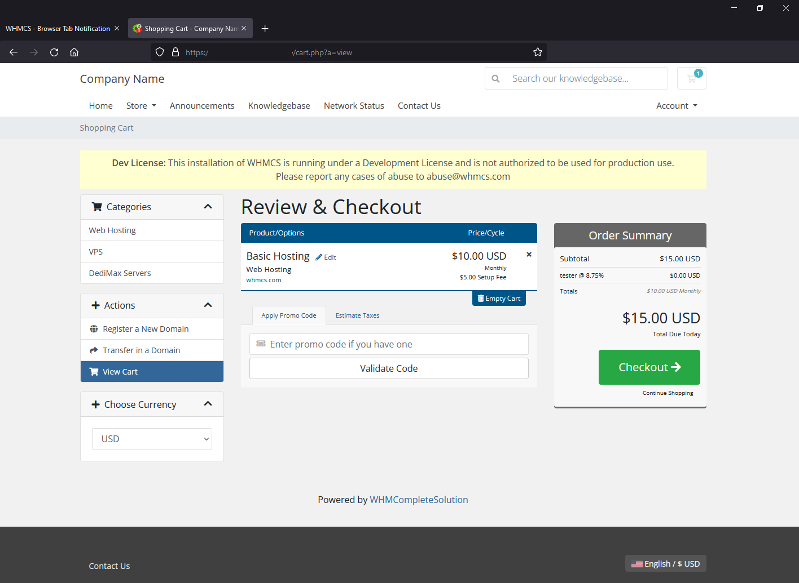
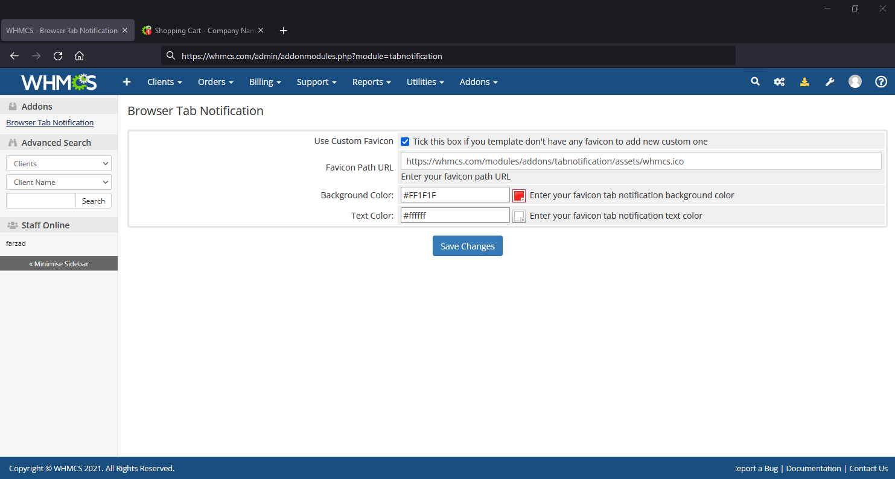

# Browser Tab Notification
Add **Browser Tab Notification** favicon in WHMCS.

 
 

**Browser Tab Notification** will decrease number of your WHMCS abandoned carts and increment purchase rate by adding a tab favicon notification, this module create a small badge notification in WHMCS favicon when client have products in cart to remind complete order.

**Features**

- Working with WHMCS 7.x and 8.x
- Customizable icon
- Customizable colors for background and text color
- Without any template changes
- Working with any WHMCS templates
- Easy Installation

 

## Installation

Download addon latest version form [latest release](https://github.com/farzadkhaledi/tabnotification/releases/latest) and extract files, then upload **tabnotification** folder to YOUR_WHMCS_ROOT/modules/addons folder.

Then login to your WHMCS admin area and in System Settings -> Addons Modules active **Browser Tab Notification** addon.

 

## Settings

First Login to your WHMCS admin area and in top menu select Addons menu and then Browser Tab Notification item, you can setup module and set your custom icon and colors.

 

## Folders

<pre>
tabnotification/
├── tabnotification.php
├── hooks.php
├── index.php
├── whmcs.json
├── logo.png
├── assets/
    ├── js/
    |   ├── index.php
    |   └── favico.min.js
    ├── index.php
    └── whmcs.ico
</pre>

 

## License

All contents are licensed under the [MIT license].

[mit license]: LICENSE
